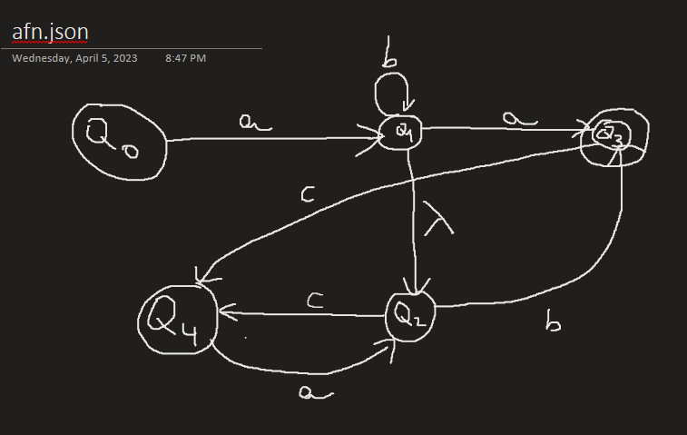

# Compilatoare și Translatoare
## CTI Anul IV - 2022 / 2023

Aici sunt temele de laborator pentru această materie.

---
În clasa [Main.java](src/main/java/org/comptrans/Main.java), în metoda de rulare se poate apela ori tema1() ori tema2() pentru a rula tema necesară

---
Tema 1 - Analizator lexical pentru un limbaj de programare la alegere (JAVA)

Sa se scrie un analizor lexical pentru un limbaj de programare la alegere. 
Scrieti analizorul sub forma unei functii care returneaza: tipul token-ului curent, lungimea sirului corespunzator din fisierul de intrare, linia din fisierul de intrare pe care se afla token-ul curent, pointer catre primul caracter al token-ulului curent, un mesaj de eroare atunci cand este intalnita o eroare lexicala. Functia este apelata din programul principal, in care este citit un fisier de intrare care va fi scanat cu ajutorul acestei functii, astfel incat sa se afiseze toti token-ii care apar in fisierul de intrare.  Atunci cand este apelata, functia de scanare:-incepand de la pointerul curent (care initial indica catre primul caracter al fisierului de intrare) sare peste un nr de caractereegal cu lungimea token-ului anterior (initial aceasta lungime este 0);-sare peste spatii, tab-uri, linii noi, pana intalneste primul caracter diferit de acestea; seteaza pointerul curent astfel ca sa indice catre acest caracter;-identifica token-ul curent, ce corespunde sirului ce incepe cu caracterul depistat la pasul anterior; determina tipul acestuia si lungimea sirului corespunzator;-Returnează numărul liniei din fișierul de intrare;-In cazul in care este intalnita o eroare lexicala, semneleaza aceasta printr-un mesaj, scaneaza fisierul de intrare in continuare, pana gaseste primul caracter de tip spatiu, linie noua, tab, seteaza pointerul curent catre acest caracter, seteaza lungimea token-ului curent cu 0 (in felul acesta programul va afisa in continuare token-ii urmatori, fara sa se opreasca la prima eroare intalnita).-se opreste cu scanarea cand a intalnit sfarsitul fisierului de intrare.

---
Tema 2 - Automatul final nedeterminist cu λ - tranziții

Program care simuleaza functionarea unui automat finit nedeterminist cu lambda-tranzitii. Programul citeste (dintr-un fisier sau de la consola) elementele unui automat finit nedeterminist cu lambda-tranzitii oarecare (stările, starea inițială, stările finale, alfabetul automatului, tranzițiile). Programul permite citirea unui număr oarecare de șiruri peste alfabetul de intrarea al automatului. Pentru fiecare astfel de șir se returnează DA sau NU, după cum șirul respectiv aparține sau nu limbajului acceptat de automat.

